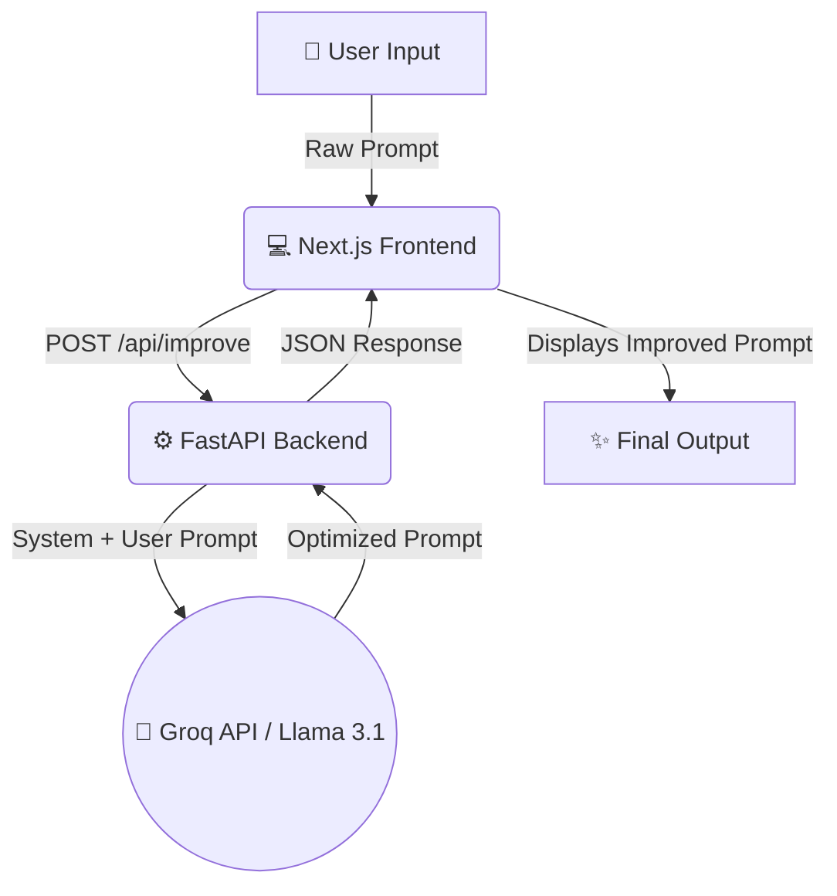

<div align="center">
  <h1>✨ PromptFix AI ✨</h1>
  <p><b>Elevate your ordinary prompts into powerful, precision-engineered AI instructions.</b></p>
  
  [](https://prompt-fix-ai.vercel.app)
  
  []()
  []()
  []()
  []()
  []()
  []()
</div>

<br />

## 🎯 What It Does

**PromptFix AI** is an intelligent assistant designed to transform your basic, unoptimized prompts into highly effective instructions for Large Language Models (LLMs). By simply entering what you want to ask an AI, PromptFix refines, structures, and optimizes your query for clarity, context, and impact. Stop struggling with vague AI responses and let PromptFix craft the perfect prompt for you.

## 🚀 Key Features

- **⚡ Instant Optimization**: Turn simple ideas into complex, well-structured prompts in seconds.
- **🧠 Expert Engineering**: Leverages a meta-prompting strategy using Llama-3.1 via Groq for high-quality prompt generation.
- **🎨 Modern UI/UX**: A beautiful, responsive interface built with Next.js, Tailwind CSS, and Framer Motion.
- **🔌 Fast Backend**: Powered by Python and FastAPI for blazingly fast API responses.
- **📋 One-Click Copy**: Easily copy your improved prompt and paste it directly into your favorite LLM (ChatGPT, Claude, etc.).

## 📂 Detailed Folder Structure

```text
PromptFix_AI/
├── frontend/                  # Next.js Frontend Application
│   ├── public/                # Static assets (images, icons)
│   ├── src/                   # Main source code for Next.js app
│   │   ├── app/               # App router (pages, layout)
│   │   ├── components/        # Reusable UI components (buttons, cards)
│   │   └── lib/               # Utility functions and API helpers
│   ├── package.json           # Frontend dependencies
│   ├── next.config.ts         # Next.js configuration
│   └── tailwind.config.js     # Tailwind CSS configuration
│
└── backend/                   # FastAPI Backend Application
    ├── main.py                # Core FastAPI application and API routes
    ├── requirements.txt       # Python dependencies (FastAPI, Groq, etc.)
    └── .env.example           # Environment variables template
```

## 🏗️ Architecture & Workflow

Here is how PromptFix AI processes your input from start to finish:



## 🛠️ Setup & Local Deployment

Running PromptFix AI locally is straightforward. The project is split into a `frontend` and a `backend`.

### Prerequisites
- Node.js (v18+)
- Python (v3.9+)
- [Groq API Key](https://console.groq.com/keys)

### Backend Setup (FastAPI)

1. Navigate to the backend directory:
   ```bash
   cd backend
   ```
2. Create and activate a virtual environment (optional but recommended):
   ```bash
   python -m venv venv
   source venv/bin/activate  # On Windows: venv\Scripts\activate
   ```
3. Install dependencies:
   ```bash
   pip install -r requirements.txt
   ```
4. Set up your environment variables:
   - Create a `.env` file in the `backend` folder.
   - Add your Groq API Key:
     ```env
     GROQ_API_KEY=your_groq_api_key_here
     ```
5. Start the backend server:
   ```bash
   uvicorn main:app --reload
   ```
   *The backend will run on `http://localhost:8000`*

### Frontend Setup (Next.js)

1. Navigate to the frontend directory:
   ```bash
   cd frontend
   ```
2. Install dependencies:
   ```bash
   npm install
   ```
3. Start the development server:
   ```bash
   npm run dev
   ```
   *The frontend will run on `http://localhost:3000`*

## 🔮 Use Cases

- **Content Creators**: Generate structured prompts for writing blogs, scripts, or social media posts.
- **Developers**: Create detailed prompts for code generation, debugging, or documentation.
- **Researchers**: Formulate precise academic queries to get accurate summaries and data analysis.
- **Everyday Users**: Get better answers for recipes, travel plans, or general knowledge without needing to learn prompt engineering.

## 🚀 Future Scope

- **Custom Optimization Modes**: Choose between modes like "Creative", "Concise", "Coding", or "Academic".
- **Prompt History**: Save and organize your favorite optimized prompts.
- **A/B Testing**: Compare different versions of an optimized prompt side-by-side.
- **Direct LLM Integration**: Directly execute the optimized prompt against various LLMs from within the app.

## 🤝 Contribution

Contributions are always welcome! If you have any ideas, bug reports, or feature requests, feel free to open an issue or submit a pull request.

1. Fork the Project
2. Create your Feature Branch (`git checkout -b feature/AmazingFeature`)
3. Commit your Changes (`git commit -m 'Add some AmazingFeature'`)
4. Push to the Branch (`git push origin feature/AmazingFeature`)
5. Open a Pull Request

---
<div align="center">
  <p>Built with ❤️ by <a href="https://github.com/Santhoshcv07">Santhosh</a></p>
</div>
